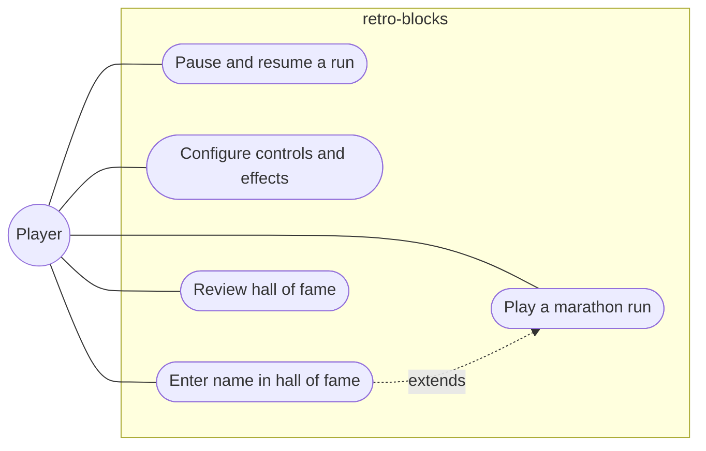

# Use cases — Player

```mermaid
flowchart LR
  P((Player))
  subgraph S [retro-blocks]
    UC1([Play a marathon run])
    UC2([Pause and resume a run])
    UC3([Configure controls and effects])
    UC4([Enter name in hall of fame])
    UC5([Review hall of fame])
  end
  P --- UC1
  P --- UC2
  P --- UC3
  P --- UC4
  P --- UC5
  UC4 -. extends .-> UC1
```
