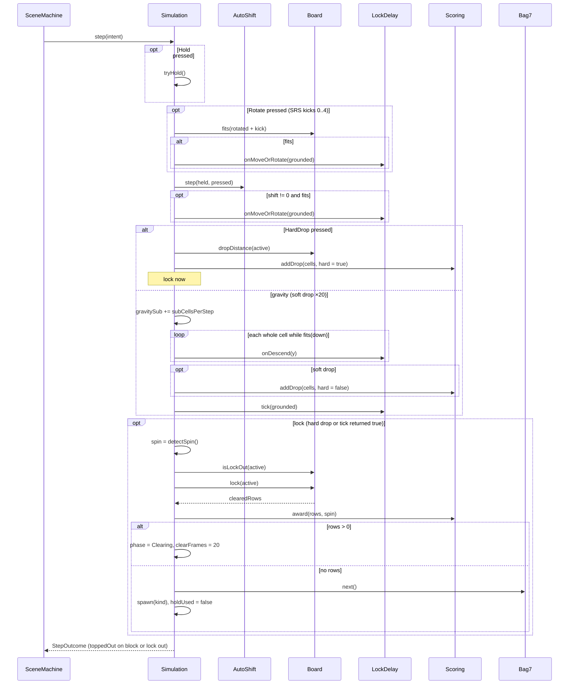

# Piece lifecycle (one 60 Hz step, phase Falling)

```mermaid
sequenceDiagram
  participant Scenes as SceneMachine
  participant Sim as Simulation
  participant Shift as AutoShift
  participant Board
  participant Lock as LockDelay
  participant Score as Scoring
  participant Bag as Bag7
  Scenes->>Sim: step(intent)
  opt Hold pressed
    Sim->>Sim: tryHold()
  end
  opt Rotate pressed (SRS kicks 0..4)
    Sim->>Board: fits(rotated + kick)
    alt fits
      Sim->>Lock: onMoveOrRotate(grounded)
    end
  end
  Sim->>Shift: step(held, pressed)
  opt shift != 0 and fits
    Sim->>Lock: onMoveOrRotate(grounded)
  end
  alt HardDrop pressed
    Sim->>Board: dropDistance(active)
    Sim->>Score: addDrop(cells, hard = true)
    Note over Sim: lock now
  else gravity (soft drop ×20)
    Sim->>Sim: gravitySub += subCellsPerStep
    loop each whole cell while fits(down)
      Sim->>Lock: onDescend(y)
    end
    opt soft drop
      Sim->>Score: addDrop(cells, hard = false)
    end
    Sim->>Lock: tick(grounded)
  end
  opt lock (hard drop or tick returned true)
    Sim->>Sim: spin = detectSpin()
    Sim->>Board: isLockOut(active)
    Sim->>Board: lock(active)
    Board-->>Sim: clearedRows
    Sim->>Score: award(rows, spin)
    alt rows > 0
      Sim->>Sim: phase = Clearing, clearFrames = 20
    else no rows
      Sim->>Bag: next()
      Sim->>Sim: spawn(kind), holdUsed = false
    end
  end
  Sim-->>Scenes: StepOutcome (toppedOut on block or lock out)
```
