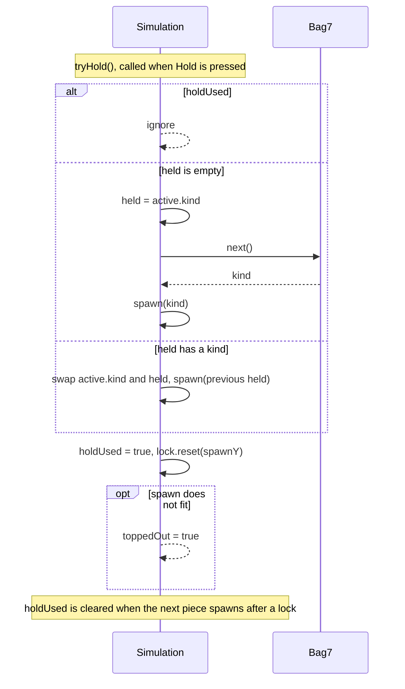

# Hold (one swap per piece)

```mermaid
sequenceDiagram
  participant Sim as Simulation
  participant Bag as Bag7
  Note over Sim: tryHold(), called when Hold is pressed
  alt holdUsed
    Sim-->>Sim: ignore
  else held is empty
    Sim->>Sim: held = active.kind
    Sim->>Bag: next()
    Bag-->>Sim: kind
    Sim->>Sim: spawn(kind)
  else held has a kind
    Sim->>Sim: swap active.kind and held, spawn(previous held)
  end
  Sim->>Sim: holdUsed = true, lock.reset(spawnY)
  opt spawn does not fit
    Sim-->>Sim: toppedOut = true
  end
  Note over Sim: holdUsed is cleared when the next piece spawns after a lock
```
