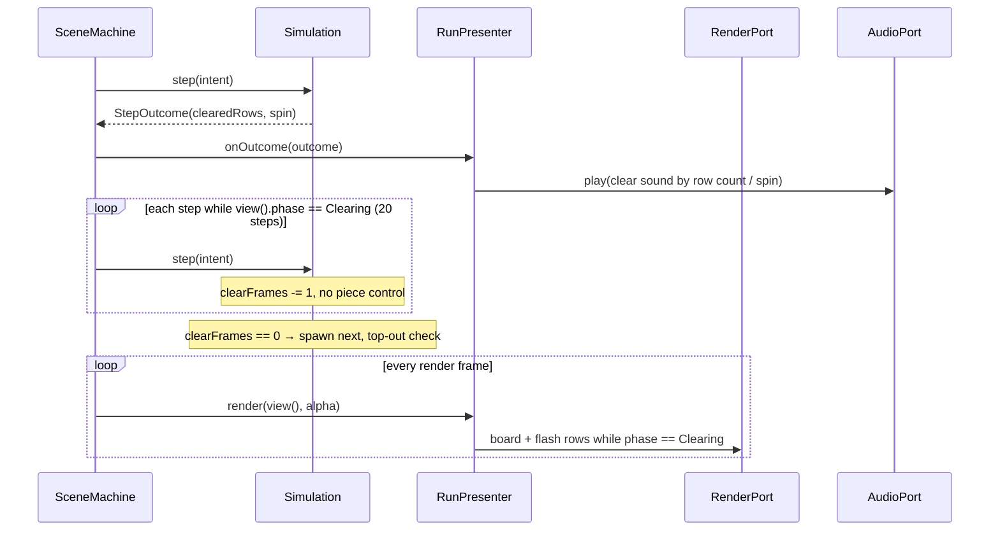

# Line clear (timing in the simulation, effects in the presenter)

```mermaid
sequenceDiagram
  participant Scenes as SceneMachine
  participant Sim as Simulation
  participant Pres as RunPresenter
  participant Render as RenderPort
  participant Audio as AudioPort
  Scenes->>Sim: step(intent)
  Sim-->>Scenes: StepOutcome(clearedRows, spin)
  Scenes->>Pres: onOutcome(outcome)
  Pres->>Audio: play(clear sound by row count / spin)
  loop each step while view().phase == Clearing (20 steps)
    Scenes->>Sim: step(intent)
    Note over Sim: clearFrames -= 1, no piece control
  end
  Note over Sim: clearFrames == 0 → spawn next, top-out check
  loop every render frame
    Scenes->>Pres: render(view(), alpha)
    Pres->>Render: board + flash rows while phase == Clearing
  end
```
